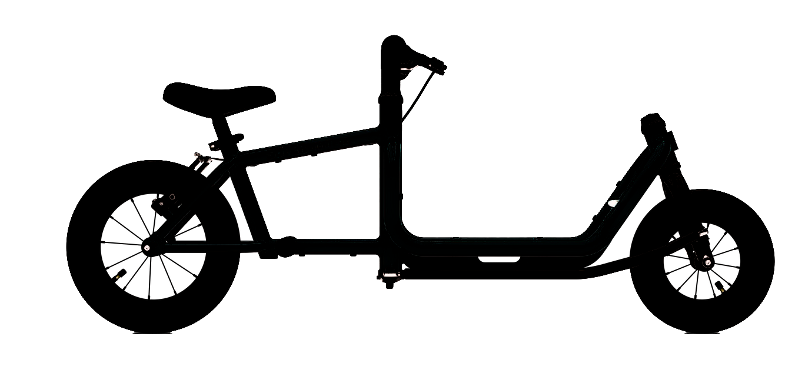
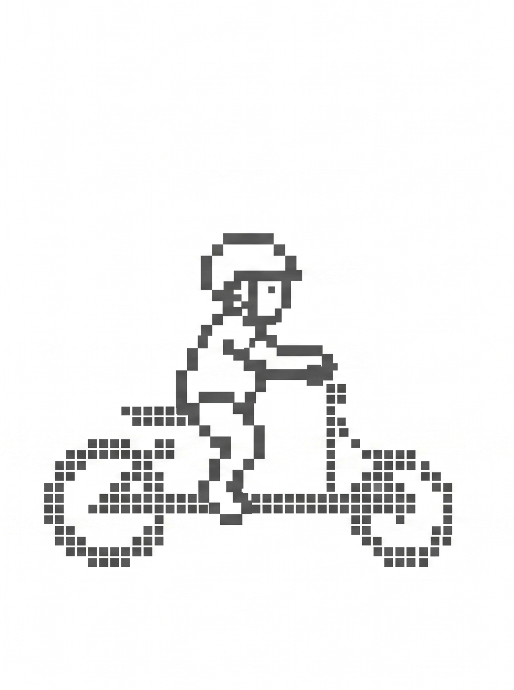
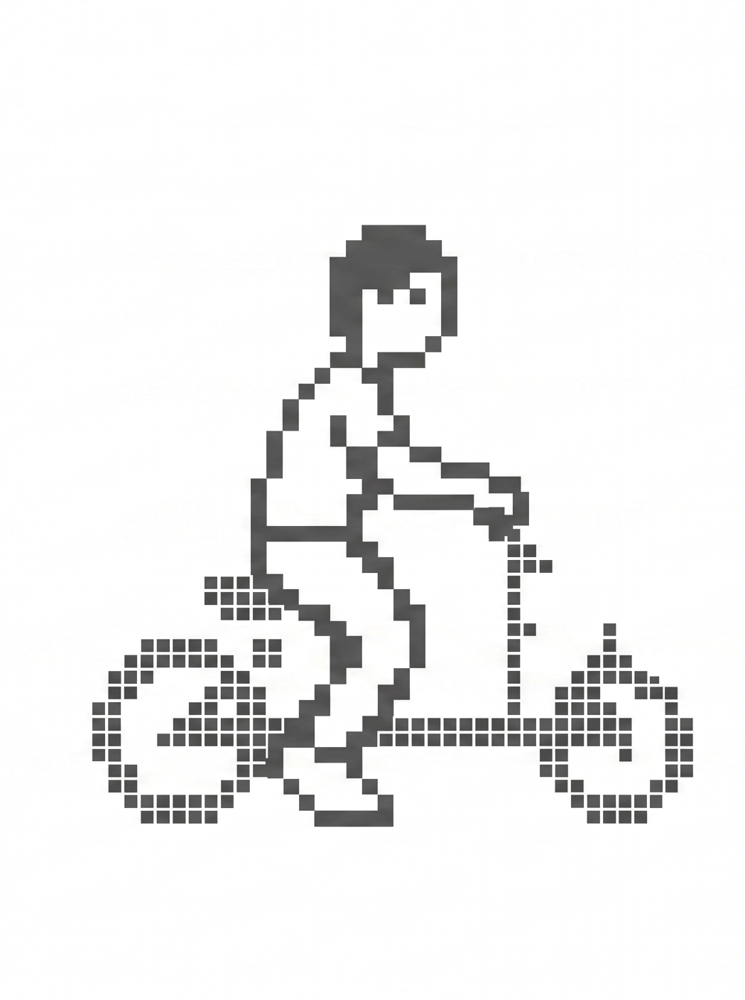
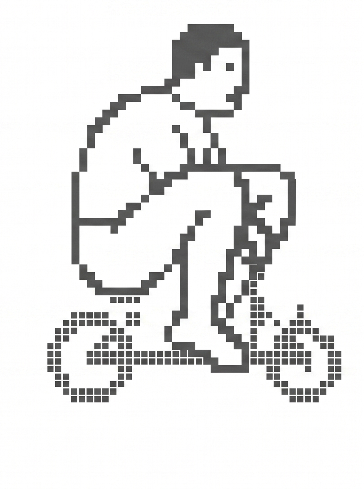

# _logo — Source Assets

Source logo files for the Moabiter Lastenlaufrad Kiez-WM 2026 website.
This folder is not served by Jekyll (prefix `_` excludes it from the build).
Processed outputs live in `../assets/images/`.

## Processing script

`process_logos.py` removes white backgrounds and thresholds to pure black:

- Pixels with luminance < 50% **and** existing alpha ≥ 50% → pure black, fully opaque
- Everything else → fully transparent

### Setup

```bash
pip install Pillow numpy
```

### Run (all default files)

```bash
python3 process_logos.py
```

### Run on specific files

```bash
python3 process_logos.py size_pro.png size_boomer.png
```

Outputs are saved as `<stem>_transparent.png` in this folder.
Copy the relevant ones to `../assets/images/` to use them on the site.

## Assets

### Original files

| Preview | File | Origin |
|---|---|---|
|  | `junior_bw.webp` | [Super Bicycles](https://super-bicycles.com) — Super Mighty Junior logo, large |
|  | `junior_bq_small.webp` | [Super Bicycles](https://super-bicycles.com) — Super Mighty Junior logo, small |
|  | `junior_bw_squares.svg` | [Vinilo](https://apps.apple.com/de/app/vinilo-crafting/id1554518531) — pixel-art squares version |
|  | `size_pro.png` | [Gemini](https://gemini.google.com) — Kindergarten class size illustration |
|  | `size_boomer.png` | [Gemini](https://gemini.google.com) — Grundschule class size illustration |
|  | `size_oldies.png` | [Gemini](https://gemini.google.com) — Erwachsene class size illustration |
|  | `size comparison.png` | [Gemini](https://gemini.google.com) — all three class sizes side by side |

### Processed files (white → transparent, threshold to pure black)

| Preview | File | Source |
|---|---|---|
|  | `junior_bw_transparent.png` | processed from `junior_bw.webp` via `process_logos.py` |
|  | `junior_bq_small_transparent.png` | processed from `junior_bq_small.webp` via `process_logos.py` |
|  | `junior_bw_squares_transparent.svg` | processed from `junior_bw_squares.svg` via [Vinilo](https://apps.apple.com/de/app/vinilo-crafting/id1554518531) |
|  | `size_pro_transparent.png` | processed from `size_pro.png` via `process_logos.py` |
|  | `size_boomer_transparent.png` | processed from `size_boomer.png` via `process_logos.py` |
|  | `size_oldies_transparent.png` | processed from `size_oldies.png` via `process_logos.py` |
